# SIEM & Detection Engineering — Wazuh Homelab

## Objective

Deploy a functional SIEM (Wazuh) in a segmented homelab environment, onboard Windows endpoints as monitored agents, establish a verified baseline, simulate attacks, document detections, and integrate a help desk ticketing system. This project demonstrates end-to-end SOC workflow — from infrastructure deployment through detection, investigation, and ticket-driven response.

---

## Lab Architecture

```
+---------------------------+       +---------------------------+
|   DC01 (192.168.56.10)    |       |   CL1 (192.168.56.11)     |
|   Windows Server 2022     |       |   Windows 11 Pro          |
|   Domain Controller       |       |   Domain: LAB.local       |
|   Wazuh Agent v4.14.4     |       |   Wazuh Agent v4.14.4     |
|   Sysmon                  |       |   Sysmon                  |
+------------+--------------+       +------------+--------------+
             |                                   |
             +---------------+-------------------+
                             |
                  +----------+----------+
                  |  Wazuh Server       |
                  |  192.168.56.20      |
                  |  Amazon Linux 2023  |
                  |  Wazuh v4.14.4 OVA  |
                  +----------+----------+
                             |
             +---------------+-------------------+
             |                                   |
+------------+--------------+       +-----------+---------------+
|  KALI (192.168.56.50)     |       |  osTicket (192.168.56.30) |
|  Attacker Machine         |       |  Ubuntu 24.04             |
|  Debian/Kali Linux        |       |  Wazuh Agent v4.14.4      |
|                           |       |  Help Desk Ticketing      |
+---------------------------+       +---------------------------+

Network: VirtualBox Host-Only (192.168.56.0/24)
Hypervisor: Oracle VirtualBox
```

---

## Environment Details

| VM | IP Address | OS | Role |
|---|---|---|---|
| DC01 | 192.168.56.10 | Windows Server 2022 Standard Eval | Domain Controller (LAB.local) |
| CL1 | 192.168.56.11 | Windows 11 Pro | Domain-joined workstation |
| Wazuh | 192.168.56.20 | Amazon Linux 2023 | SIEM / Log aggregation |
| KALI | 192.168.56.50 | Debian/Kali Linux | Attacker (isolated) |
| osTicket | 192.168.56.30 | Ubuntu 24.04 LTS | Help desk ticketing + Wazuh agent |

---

## Project Status

| Phase | Description | Status |
|---|---|---|
| 1 | Wazuh SIEM deployment | ✅ Complete |
| 2 | Agent deployment (DC01 + CL1) | ✅ Complete |
| 3 | Baseline documentation | ✅ Complete |
| 4 | Sysmon deployment | ✅ Complete |
| 5 | SMB brute force simulation & detection | ✅ Complete |
| 6 | Account lockout policy implementation | ✅ Complete |
| 7 | osTicket help desk deployment | ✅ Complete |
| 8 | Wazuh agent on osTicket VM | ✅ Complete |
| 9 | Wazuh → osTicket alert integration | ✅ Complete |
| 10 | Simulated help desk ticket workflows | 🔲 Up Next |
| 11 | CIS hardening via GPO (before/after) | 🔲 Planned |

---

## Build Steps

### Phase 1 — Wazuh Server Deployment
- Downloaded Wazuh 4.14.4 OVA from official Wazuh documentation
- Imported into VirtualBox, assigned Host-Only network adapter (`192.168.56.0/24`)
- Resolved static IP configuration issue on Amazon Linux 2023 using `systemd-networkd` (`/etc/systemd/network/10-eth0.network`) — AL2023 does not use netplan or traditional network-scripts at boot
- Configured static IP `192.168.56.20/24`, DNS pointing to DC01 (`192.168.56.10`)
- Verified connectivity: Wazuh → DC01 (0% packet loss), Wazuh → CL1 (0% packet loss)
- Accessed Wazuh dashboard via `https://192.168.56.20`

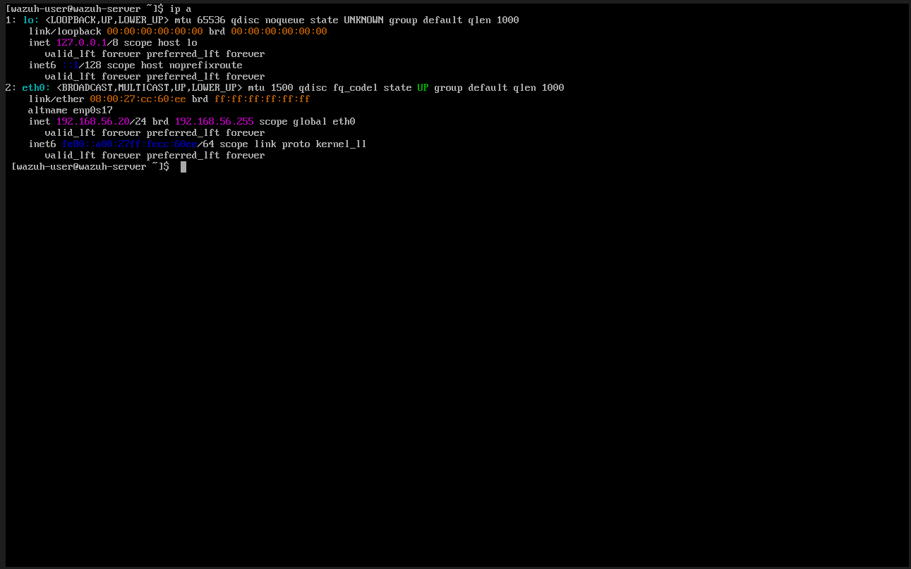
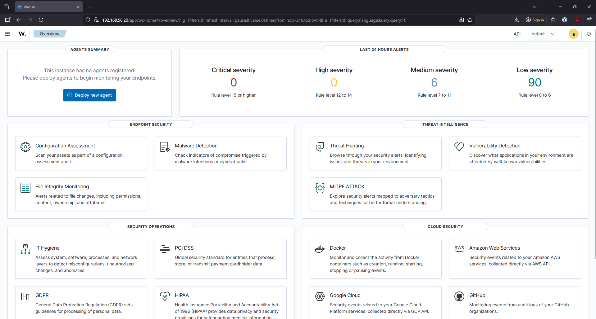

### Phase 2 — Agent Deployment
- DC01: Temporarily added NAT adapter for internet access, downloaded and installed `wazuh-agent-4.14.4-1.msi`, removed NAT adapter post-install
- CL1: Same process as DC01
- Both agents confirmed Active in Wazuh Endpoints dashboard
- NAT adapters removed from both machines post-installation — domain controllers and workstations should not have direct internet access in production

```powershell
# Agent install command used on both endpoints
msiexec /i wazuh-agent.msi /q WAZUH_MANAGER='192.168.56.20' WAZUH_AGENT_NAME='DC01'
NET START WazuhSvc
```

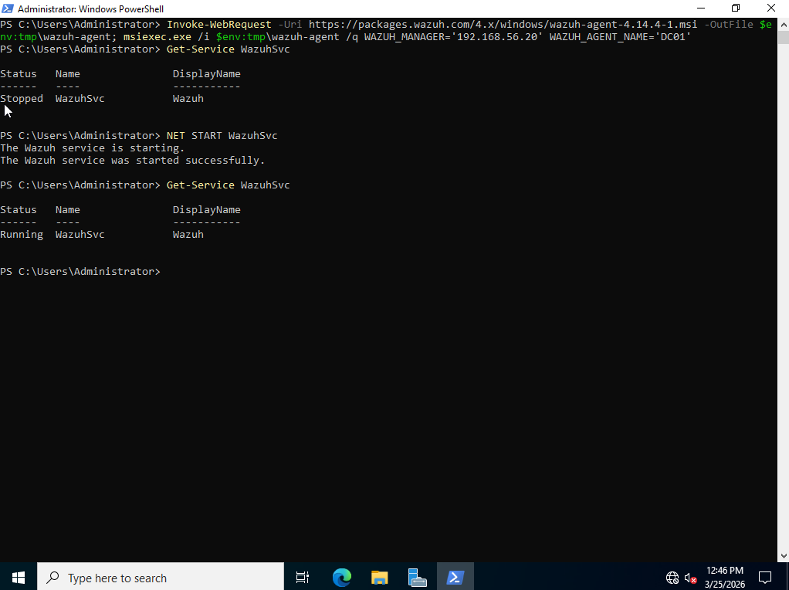
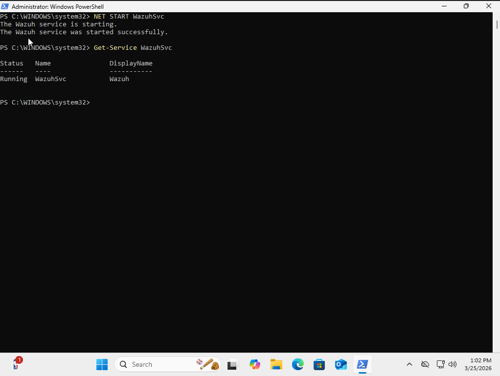
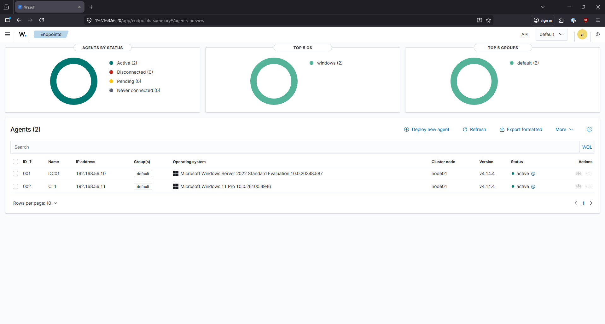

### Phase 3 — Baseline Documentation
Immediately after agent deployment, documented the following baseline state across both endpoints before any hardening or attack simulation.

### Phase 4 — Sysmon Deployment
- Deployed Sysmon with SwiftOnSecurity config on both DC01 and CL1
- Sysmon provides enhanced process creation, network connection, and file event logging beyond default Windows event logs
- Verified Sysmon events flowing into Wazuh dashboard

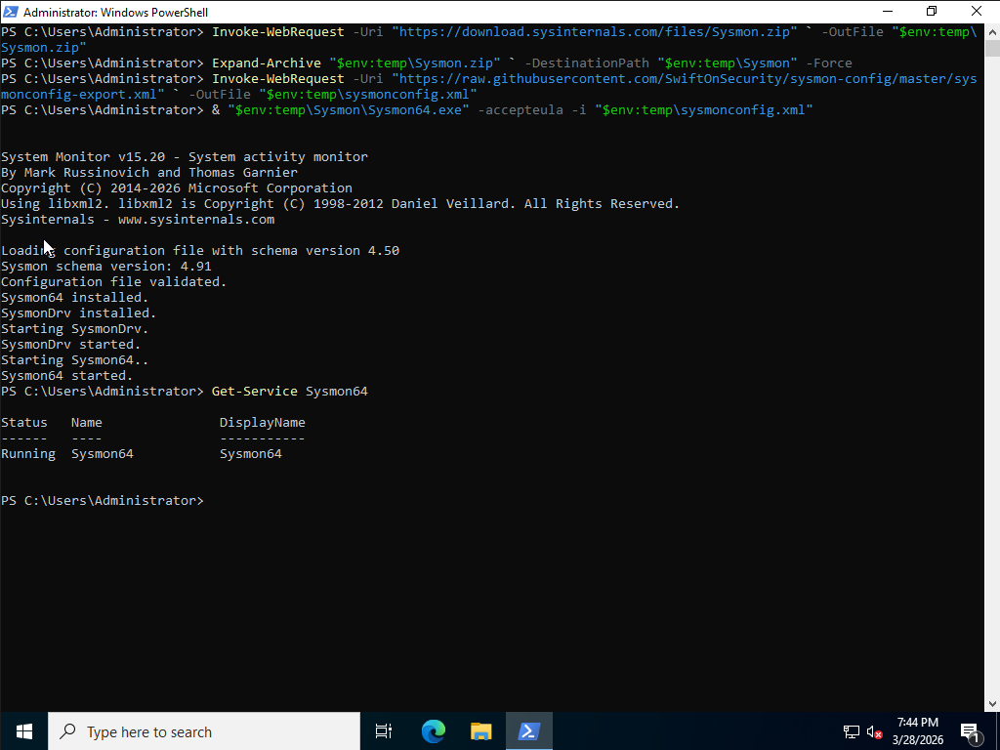
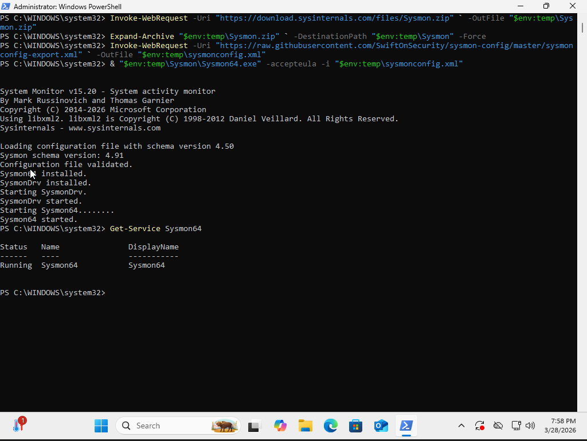

### Phase 5 — SMB Brute Force Simulation & Detection
- Executed SMB brute force attack from Kali (192.168.56.50) targeting DC01 (192.168.56.10) using Metasploit `smb_login` module
- Attack generated repeated Event ID 4625 (failed logon) entries on DC01
- Wazuh rule 18152 triggered and alerted successfully
- Full analyst workflow documented in Finding 001

→ [Finding 001 — SMB Brute Force Detection](findings/finding-001-smb-brute-force.md)

### Phase 6 — Account Lockout Policy
- Implemented account lockout GPO on DC01 to automatically lock accounts after repeated failed logons
- Policy verified via forced lockout test and confirmed in Active Directory Users and Computers
- Provides automated defense against brute force attacks detected in Phase 5

→ [Finding 002 — Account Lockout Policy](findings/finding-002-account-lockout-policy.md)

### Phase 7 — osTicket Help Desk Deployment
- Provisioned Ubuntu 24.04 VM with static IP 192.168.56.30
- Deployed full LAMP stack: Apache 2.4, MySQL 8.0.45, PHP 8.3.6 with all required extensions
- Installed osTicket v1.18.1 and completed web installer
- Post-install hardening: setup directory removed, config file locked to read-only (0644), dedicated least-privilege MySQL user

→ [Finding 003 — osTicket Deployment](findings/finding-003-osticket-deployment.md)

### Phase 8 — Wazuh Agent on osTicket VM
- Imported Wazuh GPG key and added official apt repository on Ubuntu 24.04
- Installed wazuh-agent 4.14.4, pre-configured to register with Wazuh server at 192.168.56.20
- Agent confirmed active in Wazuh Endpoints dashboard as Agent 003
- Full lab now has SIEM coverage across all VMs — no blind spots

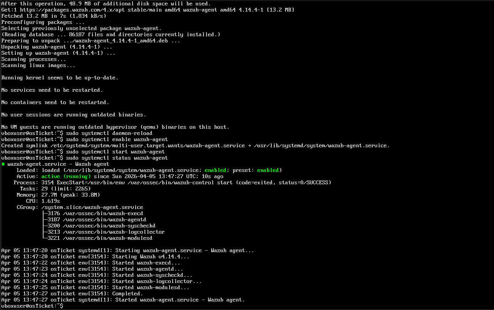
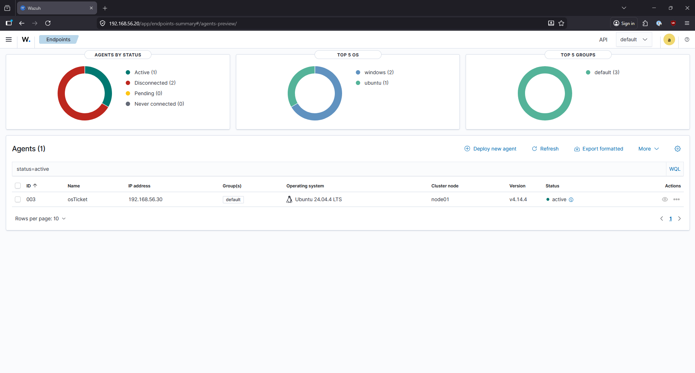

→ [Finding 004 — Wazuh Agent on osTicket VM](findings/finding-004-wazuh-agent-osticket.md)

### Phase 9 — Wazuh → osTicket Alert Integration
- Generated osTicket API key scoped to Wazuh server IP (192.168.56.20)
- Created dedicated `Wazuh SIEM` user in osTicket for ticket submission
- Developed Python integration script at `/var/ossec/integrations/custom-osticket.py`
- Script parses Wazuh alert JSON and posts ticket to osTicket REST API
- Configured Wazuh `ossec.conf` to trigger script on all level 7+ alerts
- Tested end-to-end: alert JSON → Python script → osTicket API → ticket #290138 confirmed


→ [Finding 005 — Wazuh → osTicket Integration](findings/finding-005-wazuh-osticket-integration.md)

---

## Baseline Findings — March 25, 2026 (DC01 + CL1)

### Vulnerability Detection (Combined — Both Agents)
| Severity | Count |
|---|---|
| Critical | 24 |
| High | 1,259 |
| Medium | 517 |
| Low | 15 |

**Per-agent breakdown:**
| Agent | Total Findings | Primary Vulnerable Package |
|---|---|---|
| DC01 | 1,450 | Windows Server 2022 Standard Eval 10.0.20348.587 |
| CL1 | 365 | Windows 11 Pro 10.0.26100.4946 |

**Top CVEs identified at baseline:**
| CVE | Count |
|---|---|
| CVE-2026-0102 | 3 |
| CVE-2026-21223 | 3 |
| CVE-2025-14174 | 2 |
| CVE-2025-24052 | 2 |
| CVE-2025-24990 | 2 |

These findings reflect unpatched evaluation builds on both endpoints. Baseline intentionally captured before patching to document before/after delta.

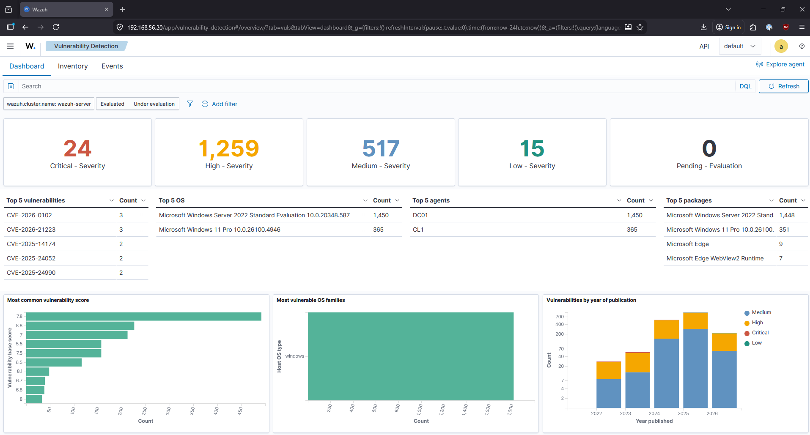
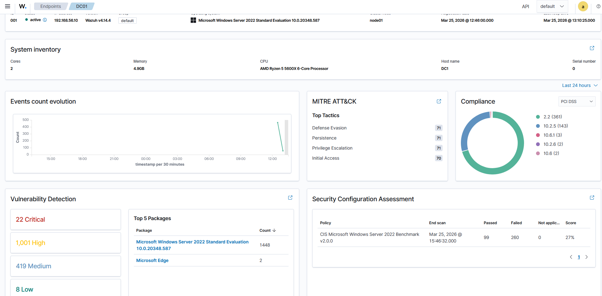

### CIS Benchmark — Windows Server 2022 (DC01)
| Policy | Passed | Failed | Score |
|---|---|---|---|
| CIS Microsoft Windows Server 2022 Benchmark v2.0.0 | 99 | 260 | **27%** |

A 27% CIS compliance score reflects a default, unconfigured domain controller. This is the expected baseline for a freshly promoted DC with no hardening applied. Target: improve score through GPO hardening.

### MITRE ATT&CK — Top Tactics (First 24 Hours, DC01)
| Tactic | Alert Count |
|---|---|
| Defense Evasion | 71 |
| Persistence | 71 |
| Privilege Escalation | 71 |
| Initial Access | 70 |

**Analyst note:** These alerts reflect normal AD operations mapped to ATT&CK techniques — not active attacks. Establishing this baseline is critical for distinguishing normal from anomalous behavior in subsequent detection exercises.

### Alert Summary (First 24 Hours — Both Agents)
| Severity | Count |
|---|---|
| Critical | 0 |
| High | 0 |
| Medium | 622 |
| Low | 477 |

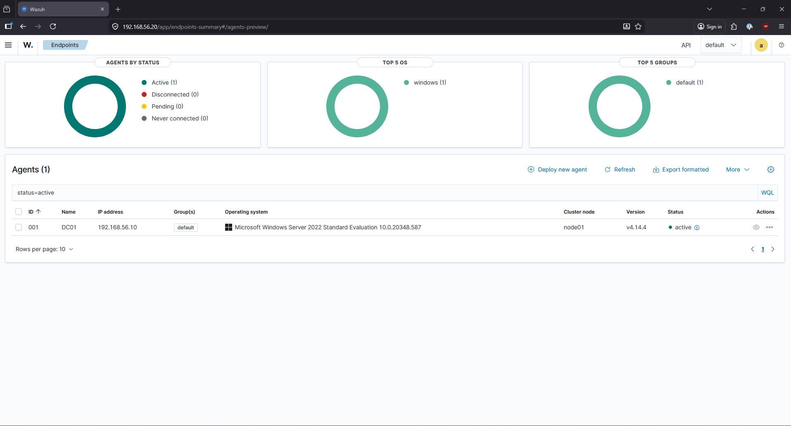

---

## Findings Index

| Finding | Title | Status |
|---|---|---|
| [001](findings/finding-001-smb-brute-force.md) | SMB Brute Force Detection | ✅ Complete |
| [002](findings/finding-002-account-lockout-policy.md) | Account Lockout Policy Implementation | ✅ Complete |
| [003](findings/finding-003-osticket-deployment.md) | osTicket Help Desk Deployment | ✅ Complete |
| [004](findings/finding-004-wazuh-agent-osticket.md) | Wazuh Agent on osTicket VM | ✅ Complete |
| [005](findings/finding-005-wazuh-osticket-integration.md) | Wazuh → osTicket Alert Integration | ✅ Complete |

---

## Connectivity Verification

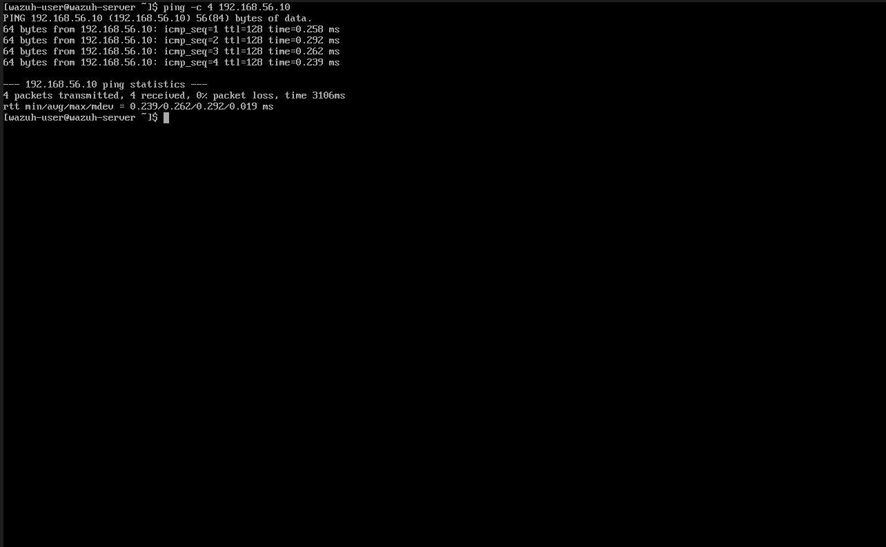


---

## Lessons Learned

- **Amazon Linux 2023 networking:** AL2023 does not use netplan (Ubuntu) or persist traditional `ifcfg` scripts via the `network` service at boot. Static IP configuration requires `systemd-networkd` with a `.network` file in `/etc/systemd/network/`.
- **Temporary internet access for agent install:** When endpoints have no internet access (host-only network), the cleanest approach is temporarily attaching a NAT adapter, installing the agent, then removing the adapter. Adapter removal must be verified post-install — leaving internet access on a DC is a security risk.
- **Baseline before hardening:** Capturing CIS score, vulnerability count, and MITRE alert baseline before making any changes creates measurable proof of improvement — a critical element of any professional security engagement.
- **Apache PHP module:** On Ubuntu 24.04, PHP is not automatically linked to Apache after installation. `libapache2-mod-php8.3` and `a2enmod php8.3` must be explicitly run or Apache will serve raw PHP code instead of executing it.
- **Post-install hardening matters:** Leaving the osTicket `/setup/` directory accessible after installation allows unauthenticated reinstallation — removing it immediately is a mandatory security step.
- **osTicket API endpoint:** osTicket v1.18 uses `/api/http.php/tickets.json` not `/api/tickets.json`. Always verify API endpoints against the installed version.
- **osTicket email validation:** osTicket rejects `.local` TLD email addresses as invalid. Use standard TLD addresses for API users and system accounts.
- **SCP for file transfers:** When copy-paste is unavailable between host and VM, SCP from the Windows host is the most reliable way to transfer scripts and config files without manual typing errors.

---

## Next Steps

- [ ] Start DC01 and CL1, trigger a real Wazuh alert, confirm auto-ticket generation end-to-end
- [ ] Simulate help desk workflows — account lockout response, malware alert triage
- [ ] Document full ticket lifecycle as Finding 006
- [ ] CIS hardening via GPO with before/after score comparison
- [ ] Patch critical CVEs, rescan to show vulnerability reduction

---

## Screenshots Index

| File | Description |
|---|---|
| `StaticIPConfiguredPreAgentDeployment.png` | Wazuh VM static IP confirmed post-reboot |
| `WazuhStaticIPDashboardConfirmedPreAgentDeployment.png` | Dashboard accessible at static IP pre-agent deployment |
| `WazuhDC01Running.png` | WazuhSvc running on DC01 |
| `WazuhCL1Running.png` | WazuhSvc running on CL1 |
| `WazuhCL1Agent.png` | Both agents active in Wazuh Endpoints view |
| `WazuhDC01.png` | DC01 agent detail view in dashboard |
| `WazuhDC01Agent.png` | DC01 agent registration confirmation |
| `DC01vulns.png` | DC01 vulnerability and MITRE baseline |
| `WazuhVulnOverview.png` | Combined vulnerability overview — DC01 + CL1 |
| `WazuhToDC.png` | Connectivity verification Wazuh → DC01 |
| `WazuhToCL1.png` | Connectivity verification Wazuh → CL1 |
| `DC01SysmonRunning.png` | Sysmon service confirmed running on DC01 |
| `CL1SysmonRunning.png` | Sysmon service confirmed running on CL1 |
| `osTicketDatabaseCreation.png` | MySQL database and user creation for osTicket |
| `osTicketInstall.png` | osTicket web installer success screen |
| `SecureConfFile.png` | Post-install config lockdown and setup removal |
| `osTicketFirstLogon.png` | Admin Control Panel confirmed accessible |
| `WazuhOsTicketIntegration.png` | Wazuh agent active on osTicket VM |
| `osTicketAddedToDash.png` | osTicket VM confirmed in Wazuh Endpoints dashboard |
| `JsonTest.png` | Python integration script test successful |
| `TicketTestTriggerLevel.png` | Wazuh alert ticket confirmed in osTicket dashboard |
