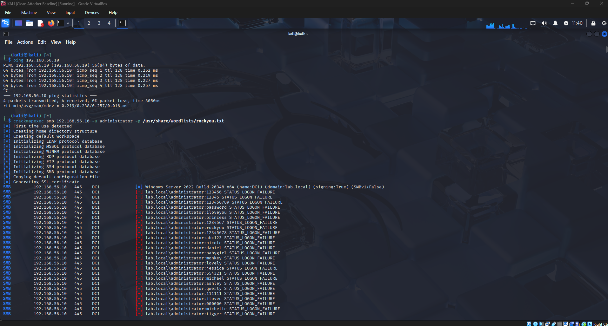
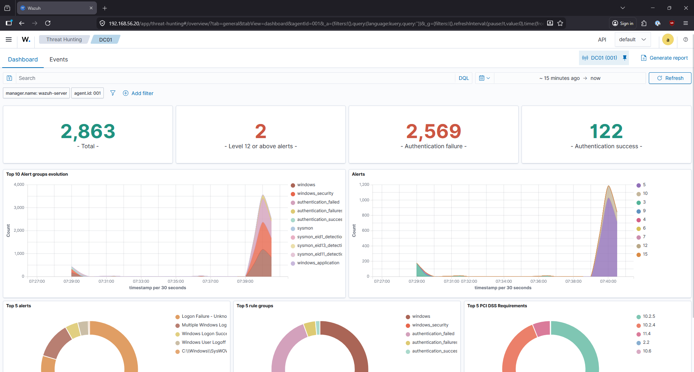
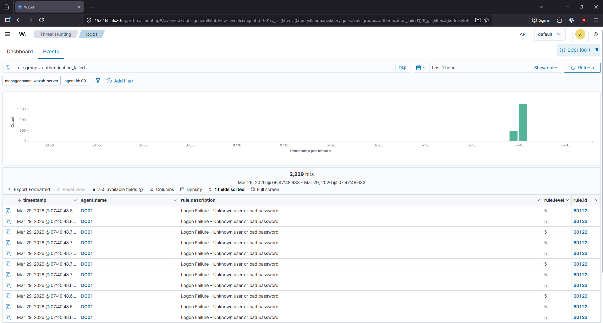
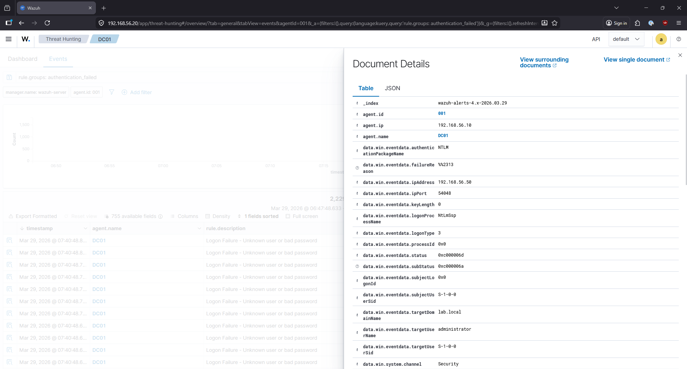

# Finding 001 — SMB Brute Force Attack Detection

**Date:** March 29, 2026  
**Analyst:** Austin Tucker  
**Environment:** AT-Security Homelab (LAB.local)  
**Severity:** High  
**Status:** Detected — No Compromise  

---

## Summary

A simulated SMB brute force attack was launched from the attacker machine (Kali Linux) against the domain controller (DC01) using the CrackMapExec tool and the rockyou.txt wordlist. The attack generated 2,229 authentication failure events (Windows Event ID 4625) within a 2-minute window. Wazuh detected the attack via rule 60122 and the activity was confirmed through forensic event analysis.

---

## Attack Details

| Field | Value |
|---|---|
| **Attack type** | SMB brute force — password spraying |
| **Tool used** | CrackMapExec v5.4.0 |
| **Wordlist** | /usr/share/wordlists/rockyou.txt (14,344,399 entries) |
| **Source IP** | 192.168.56.50 (Kali — attacker) |
| **Target IP** | 192.168.56.10 (DC01 — domain controller) |
| **Target port** | 445 (SMB/Microsoft-DS) |
| **Target account** | administrator (lab.local) |
| **Authentication protocol** | NTLM (NtLmSsp) |
| **Logon type** | 3 (Network logon) |
| **Attack start** | Mar 29, 2026 @ 07:39:00 |
| **Attack end** | Mar 29, 2026 @ 07:41:00 |
| **Duration** | ~2 minutes |

---

## Detection

### Wazuh Alert Summary

| Metric | Value |
|---|---|
| Total alerts generated | 2,863 |
| Authentication failures | 2,569 |
| Authentication successes (baseline) | 122 |
| High severity alerts (Level 12+) | 2 |
| Primary rule triggered | 60122 — Logon Failure: Unknown user or bad password |
| Rule groups | windows, windows_security, authentication_failed, authentication_failures |

### Timeline

The attack produced a clear and unmistakable signature in the Wazuh dashboard — a flat baseline from 06:47 to 07:35, a vertical spike beginning at exactly 07:39 reaching over 1,500 events per minute, returning to baseline when the attack was stopped. This pattern is characteristic of automated credential stuffing and would immediately alert a SOC analyst.

---

## Forensic Event Analysis

Individual event inspection confirmed all forensic indicators of an SMB brute force attack. The following fields were extracted from a single Event ID 4625 log entry:

| Field | Value | Significance |
|---|---|---|
| `agent.name` | DC01 | Victim — domain controller targeted |
| `data.win.eventdata.ipAddress` | 192.168.56.50 | Attacker IP — Kali machine |
| `data.win.eventdata.targetUserName` | administrator | High-value account targeted |
| `data.win.eventdata.targetDomainName` | lab.local | Domain confirmed |
| `data.win.eventdata.logonType` | 3 | Network logon — remote attempt |
| `data.win.eventdata.logonProcessName` | NtLmSsp | NTLM authentication used |
| `data.win.eventdata.authenticationPackageName` | NTLM | SMB/NTLM brute force confirmed |
| `data.win.eventdata.failureReason` | %%2313 | Bad password |
| `data.win.eventdata.status` | 0xc000006d | Windows logon failure status code |
| `data.win.system.channel` | Security | Windows Security Event Log |

---

## MITRE ATT&CK Mapping

| Tactic | Technique | ID |
|---|---|---|
| Credential Access | Brute Force: Password Guessing | T1110.001 |
| Discovery | Account Discovery: Domain Account | T1087.002 |

---

## Pre-Requisites for Detection

The following conditions were required for this detection to work:

- Wazuh agent installed and running on DC01 (`WazuhSvc`)
- Sysmon v15.20 installed on DC01 with SwiftOnSecurity config
- `Microsoft-Windows-Sysmon/Operational` log channel added to `ossec.conf`
- Windows Security Event logging enabled (default on Server 2022)
- SMB inbound firewall rule created on DC01 for lab simulation (`Allow SMB Inbound (Lab)`)

**Note:** The SMB inbound firewall rule was created specifically for this lab exercise. In a production environment, port 445 should never be exposed inbound from untrusted network segments. The rule should be removed after lab exercises are complete.

---

## Analyst Response (Simulated)

If this were a real incident, the following response steps would apply under NIST 800-61 IR lifecycle:

**Containment:**
- Block source IP `192.168.56.50` at the firewall immediately
- Disable the targeted administrator account temporarily
- Force password reset on all privileged accounts

**Eradication:**
- Review all successful logons from `192.168.56.50` in the same window
- Check for any new accounts or scheduled tasks created during the attack window
- Review DC01 for any lateral movement indicators

**Recovery:**
- Re-enable accounts after password reset confirmed
- Monitor for repeat attempts from same or similar source IPs
- Review account lockout policy — if lockout was not configured, this attack ran unimpeded

**Lessons Learned:**
- Account lockout policy should be enforced (e.g., lock after 5 failed attempts in 30 minutes)
- Administrator account should be renamed or disabled in favor of a named admin account
- Network segmentation should prevent Kali (attacker) from reaching DC01 on port 445

---

## Lessons Learned (Lab)

- **SMB signing on Windows Server 2022** is enabled by default (`signing:True` visible in CrackMapExec output). Hydra's SMB module failed because it does not handle SMB signing — CrackMapExec handles it correctly. Tool selection matters for SMB-based attacks.
- **NetworkManager on Kali** reassigns DHCP leases automatically — setting `nmcli device set eth1 managed no` is required to maintain a static IP on the host-only interface without NetworkManager overriding it.
- **Wazuh rule 60122** fires on individual 4625 events at level 5. Correlation rules fire at level 12 when multiple failures occur within a threshold window — this is the alert that would page a SOC analyst.
- **The attack signature is unambiguous** — 2,229 failures in 2 minutes is not noise. Any SIEM with authentication failure alerting would catch this immediately.

---

## Screenshots

| File | Description |
|---|---|
| `SMBAttack.png` | CrackMapExec running from Kali showing STATUS_LOGON_FAILURE per attempt |
| `WazuhSMBEvent.png` | Wazuh dashboard showing 2,569 auth failures and alert spike |
| `FailedLogonPostAttackEvents.png` | 2,229 hits filtered by authentication_failed rule group |
| `WazuhEventInspection.png` | Full forensic detail of individual Event ID 4625 |
