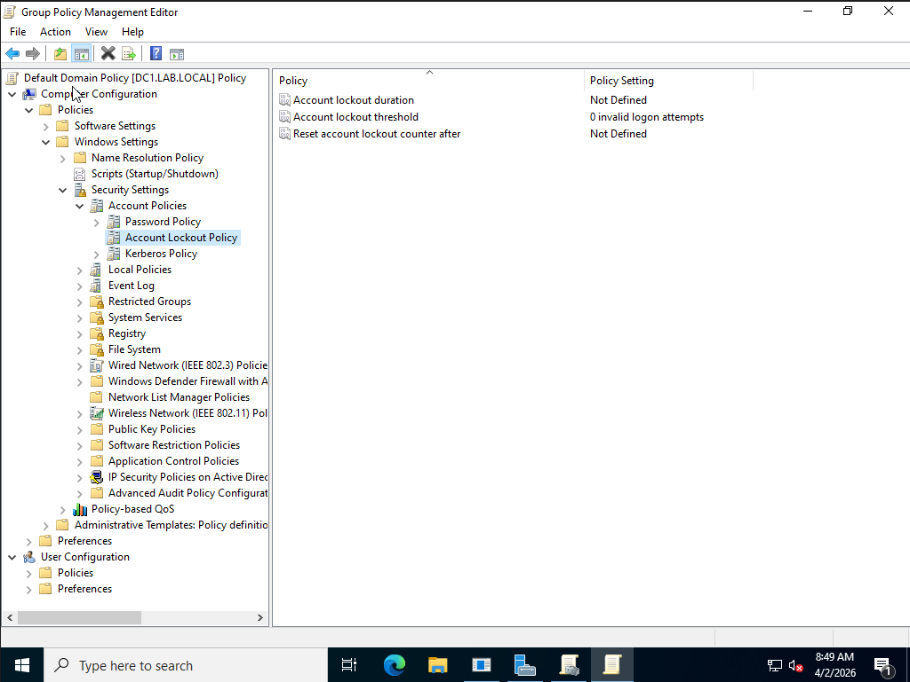
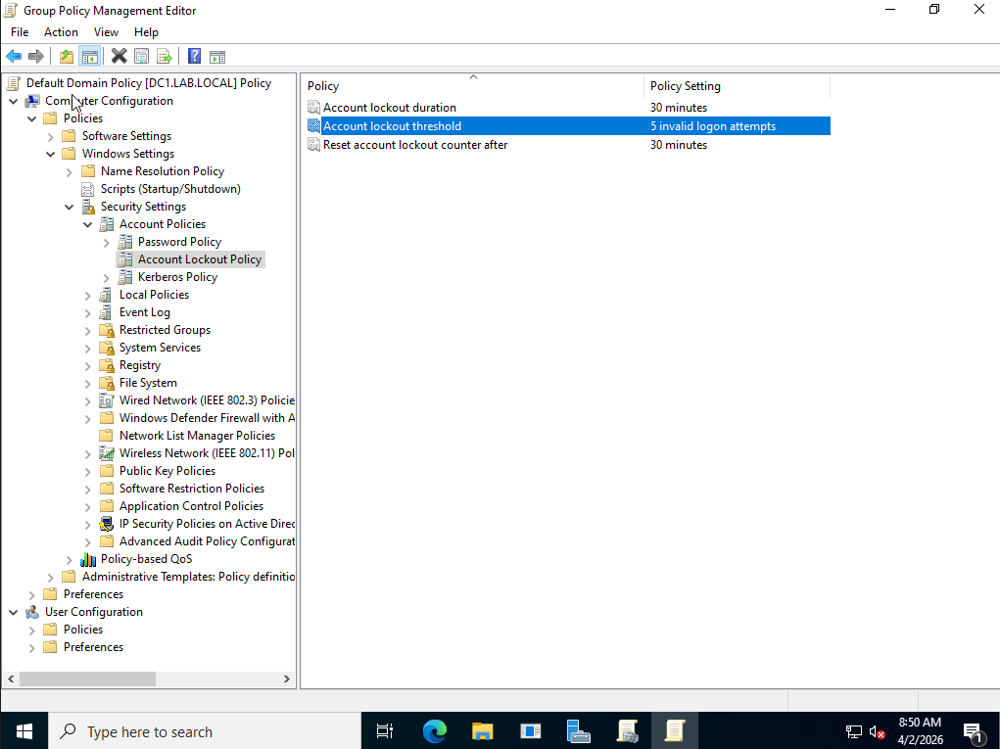
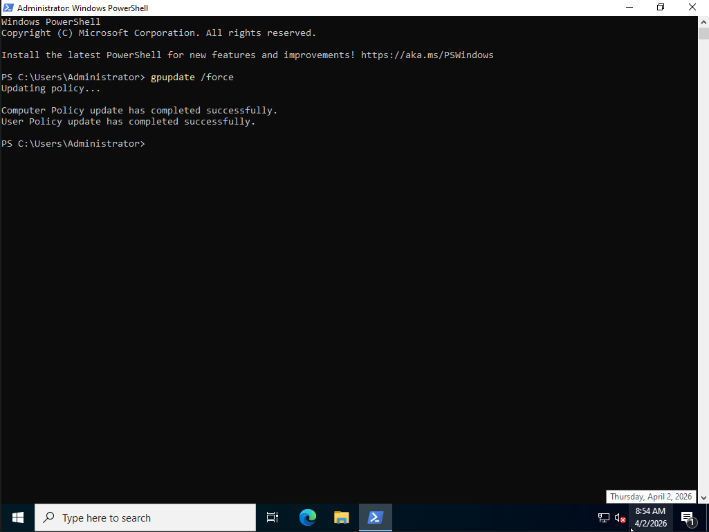
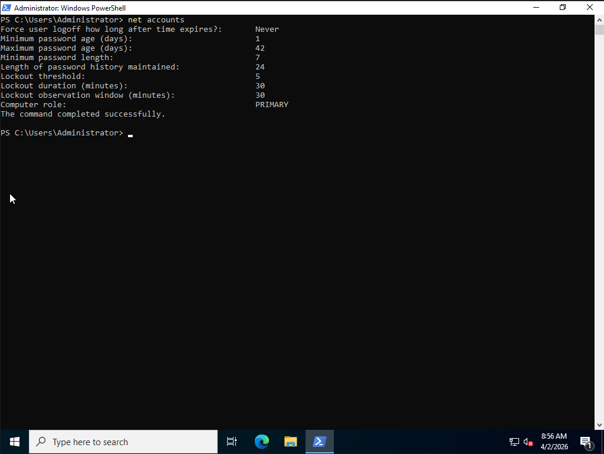
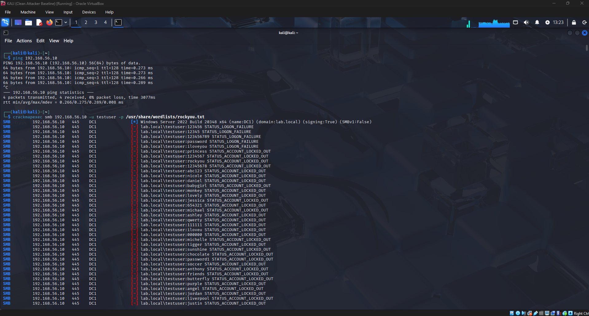
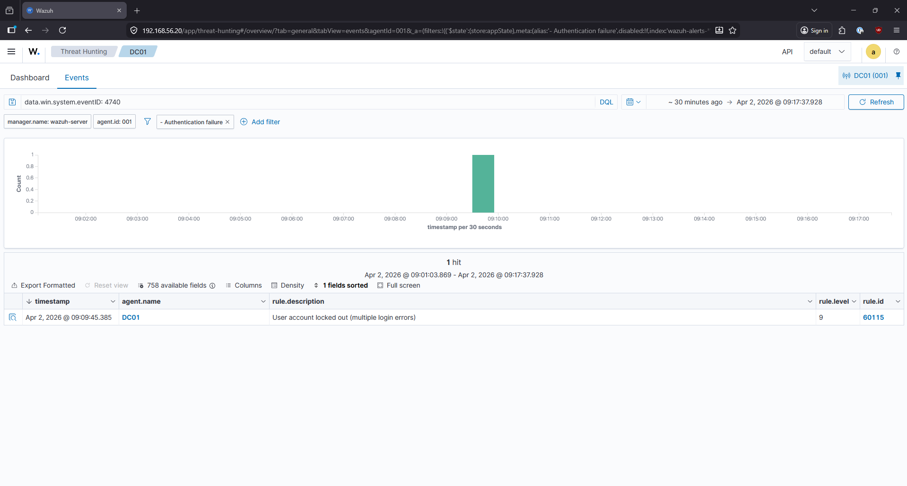
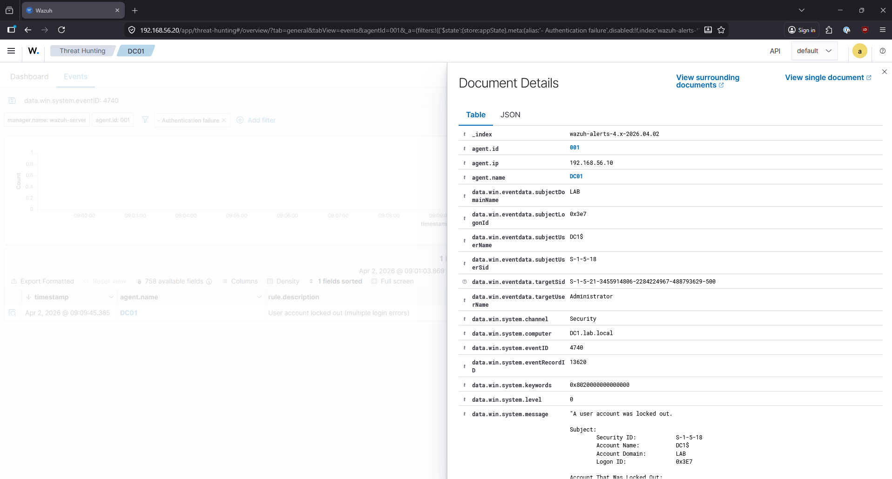
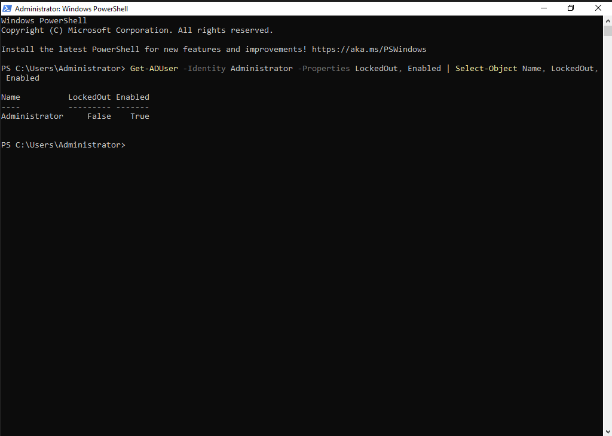

# Finding 002 — Account Lockout Policy Implementation & Brute Force Mitigation Verification

**Date:** April 2, 2026  
**Analyst:** Austin Tucker  
**Environment:** AT-Security Homelab (LAB.local)  
**Severity:** Medium (Hardening Action)  
**Status:** Control Implemented — Verified Effective  

---

## Summary

Following the SMB brute force attack documented in Finding 001, an Account Lockout Policy was implemented via Group Policy on DC01 to mitigate credential stuffing attacks against standard domain accounts. The policy was verified effective through a controlled re-test, with the target account locking out after exactly 5 failed attempts. An additional security gap was identified — the built-in Administrator account (RID 500) is exempt from lockout policy by Windows design, representing a residual risk requiring separate mitigation.

---

## Baseline State (Pre-Hardening)

Before this change, no account lockout policy was defined on the domain. This was confirmed via Group Policy Management and `net accounts`:

| Setting | Before |
|---|---|
| Account lockout threshold | Not Defined (0 attempts) |
| Account lockout duration | Not Defined |
| Reset account lockout counter after | Not Defined |

This allowed the brute force attack in Finding 001 to run against the Administrator account for over 2 minutes, generating 2,569 authentication failures with no automated response.



---

## Hardening Action — GPO Configuration

Account lockout policy was configured via **Default Domain Policy** in Group Policy Management Editor:

**Path:** Computer Configuration → Policies → Windows Settings → Security Settings → Account Policies → Account Lockout Policy

| Setting | Value | Rationale |
|---|---|---|
| Account lockout threshold | **5 invalid logon attempts** | Limits brute force window to 5 attempts |
| Account lockout duration | **30 minutes** | Auto-unlocks after 30 min, reducing admin burden |
| Reset account lockout counter after | **30 minutes** | Resets failed attempt counter after 30 min |

This configuration aligns with CIS Microsoft Windows Server 2022 Benchmark recommendations.



---

## Policy Deployment

Policy was pushed immediately using `gpupdate /force` rather than waiting for the default 90-minute Group Policy refresh cycle:

```powershell
gpupdate /force
```

Output confirmed:
```
Computer Policy update has completed successfully.
User Policy update has completed successfully.
```



Policy application was verified using `net accounts`:

```powershell
net accounts
```

| Setting | Confirmed Value |
|---|---|
| Lockout threshold | 5 |
| Lockout duration (minutes) | 30 |
| Lockout observation window (minutes) | 30 |



---

## Verification Test

### Test Setup
A standard domain user `testuser` (testuser@lab.local) was created to verify lockout policy behavior. The built-in Administrator account was used in the initial re-test but did not lock out — see Security Gap section below.

```powershell
New-ADUser -Name "testuser" `
  -SamAccountName "testuser" `
  -UserPrincipalName "testuser@lab.local" `
  -AccountPassword (ConvertTo-SecureString "Password123!" -AsPlainText -Force) `
  -Enabled $true
```


### Attack Execution
Same CrackMapExec brute force attack from Finding 001, targeting `testuser`:

```bash
crackmapexec smb 192.168.56.10 -u testuser -p /usr/share/wordlists/rockyou.txt
```

### Result
The account locked out after exactly **5 failed attempts**:

```
[-] lab.local\testuser:123456      STATUS_LOGON_FAILURE
[-] lab.local\testuser:12345       STATUS_LOGON_FAILURE
[-] lab.local\testuser:123456789   STATUS_LOGON_FAILURE
[-] lab.local\testuser:password    STATUS_LOGON_FAILURE
[-] lab.local\testuser:iloveyou    STATUS_LOGON_FAILURE
[-] lab.local\testuser:princess    STATUS_ACCOUNT_LOCKED_OUT  ← lockout fired
[-] lab.local\testuser:1234567     STATUS_ACCOUNT_LOCKED_OUT
[-] lab.local\testuser:rockyou     STATUS_ACCOUNT_LOCKED_OUT
```

Every subsequent attempt returned `STATUS_ACCOUNT_LOCKED_OUT` — the attack was completely neutralized.



---

## Wazuh Detection — Event ID 4740

Wazuh detected the account lockout via Windows Security Event ID 4740, mapped to Wazuh rule 60115:

| Field | Value |
|---|---|
| Event ID | **4740** |
| Rule | 60115 — "User account locked out (multiple login errors)" |
| Rule level | 9 |
| Timestamp | Apr 2, 2026 @ 09:09:45 |
| Agent | DC01 (192.168.56.10) |
| Channel | Security |
| Message | "A user account was locked out" |




---

## Security Gap Identified — Built-in Administrator Lockout Exemption

During initial re-testing against the Administrator account, no lockout occurred despite thousands of failed attempts. Investigation confirmed that the built-in Administrator account (RID 500) is **exempt from account lockout policy by Windows design** — this behavior cannot be changed via standard lockout policy.

```powershell
Get-ADUser -Identity Administrator -Properties LockedOut, Enabled
# LockedOut: False — even after 2,000+ failed attempts
```



**Residual Risk:** The built-in Administrator account remains vulnerable to unlimited brute force attempts. This is a known Windows security limitation documented in CIS Benchmark controls.

**Recommended Mitigations:**
- Rename the built-in Administrator account to a non-obvious name
- Disable the built-in Administrator account and use a named admin account instead
- Enforce strong password policy (minimum 15 characters) on privileged accounts
- Implement network segmentation to prevent SMB access from untrusted segments
- Consider Microsoft LAPS (Local Administrator Password Solution) for local admin accounts

---

## Before vs. After Comparison

| Metric | Before (Finding 001) | After (Finding 002) |
|---|---|---|
| Lockout policy | Not defined | 5 attempts / 30 min |
| Attack duration | 2+ minutes unimpeded | Stopped after 5 attempts |
| Auth failures generated | 2,569 | ~5 before lockout |
| Account lockout events (4740) | 0 | 1 (immediate) |
| Attacker outcome | Unlimited attempts | Blocked — account locked |

---

## MITRE ATT&CK Mapping

| Tactic | Technique | ID | Mitigation |
|---|---|---|---|
| Credential Access | Brute Force: Password Guessing | T1110.001 | Account lockout policy (M1036) |
| Defense | Account Use Policies | M1036 | Implemented via GPO |

---

## Lessons Learned

- **Built-in Administrator (RID 500) lockout exemption** is a Windows design behavior, not a misconfiguration. The only effective mitigations are renaming/disabling the account or network-level controls preventing SMB access.
- **GPO changes require force push or reboot** to apply immediately — `gpupdate /force` is essential for time-sensitive security changes in a real incident response scenario.
- **Event ID 4740 is a high-value alert** — a single 4740 event in Wazuh indicates a brute force threshold was hit. Unlike the volume of 4625 events, a single 4740 is an unambiguous indicator of a brute force attack in progress.
- **Testing with a standard user vs. privileged account** revealed different security behaviors. Understanding account type distinctions is critical for accurate security assessments.

---

## Screenshots Index

| File | Description |
|---|---|
| `GpLockoutPolicy.png` | Baseline — lockout policy Not Defined before hardening |
| `AccountLockoutChange.png` | GPO configured with 5 attempt threshold |
| `GpUpdate.png` | gpupdate /force confirming policy applied |
| `GpUpdateVerified.png` | net accounts confirming lockout settings active |
| `CreatedTestUser.png` | testuser domain account created for verification |
| `AdminUserLockoutStatus.png` | Built-in Administrator lockout exemption confirmed |
| `TestUserLockedOutKaliAttack.png` | CrackMapExec showing transition to STATUS_ACCOUNT_LOCKED_OUT |
| `TestUserLockedOut4740.png` | Wazuh showing single Event ID 4740 lockout detection |
| `4740TestUserExpanded.png` | Forensic detail of 4740 event in Wazuh |
| `KaliAttackAdministratorPostUpdate.png` | Administrator account attack showing no lockout |
| `WazuhDashPostAttack.png` | Wazuh dashboard during attack |
| `TestUserWazuhLogonFailure.png` | Authentication failure events in Wazuh |
