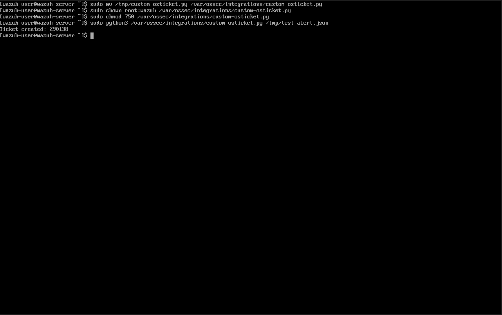
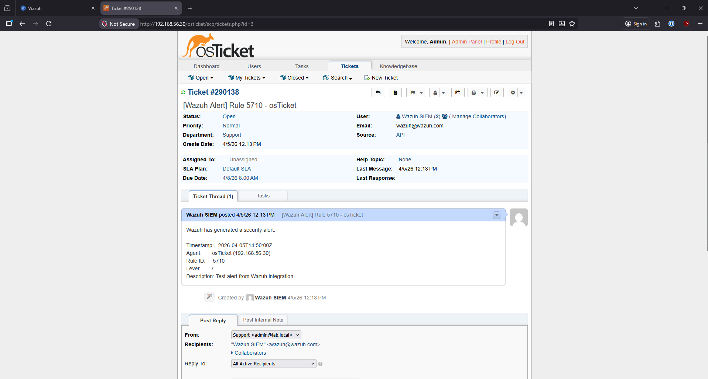

# Finding 005 — Wazuh → osTicket Alert Integration

## Environment
| Component | Details |
|-----------|---------|
| SIEM | Wazuh 4.14.4 — 192.168.56.20 |
| Help Desk | osTicket v1.18.1 — 192.168.56.30 |
| Integration Script | /var/ossec/integrations/custom-osticket.py |
| Trigger Level | Wazuh alerts level 7 and above |

## Objective
Integrate Wazuh SIEM with osTicket so that security alerts automatically generate help desk tickets — simulating a real SOC workflow where detections flow directly into a ticketing system for analyst assignment, tracking, and response documentation.

## Architecture
```
Wazuh Alert Fires (level 7+)
        |
        v
Wazuh Integration Engine
        |
        v
custom-osticket.py (Python script)
        |
        v
osTicket REST API (http.php/tickets.json)
        |
        v
Ticket Created in osTicket Dashboard
```

## Implementation Steps

### 1. Generate osTicket API Key
- Navigated to Admin Panel → Manage → API → Add New API Key
- Set IP Address to `192.168.56.20` (Wazuh server)
- Enabled: Can Create Tickets
- API Key generated: stored securely in integration script

### 2. Create Wazuh SIEM User in osTicket
- Navigated to Agent Panel → Users → Add User
- Name: `Wazuh SIEM`
- Email: `wazuh@wazuh.com`
- This user is the ticket submitter for all Wazuh-generated alerts

### 3. Python Integration Script
Created `/var/ossec/integrations/custom-osticket.py`:

```python
#!/usr/bin/env python3
import sys
import json
import urllib.request

OSTICKET_URL = "http://192.168.56.30/osticket/api/http.php/tickets.json"
API_KEY = "<api-key-stored-securely>"

def create_ticket(alert):
    rule = alert.get("rule", {})
    agent = alert.get("agent", {})
    rule_id = rule.get("id", "N/A")
    rule_desc = rule.get("description", "No description")
    agent_name = agent.get("name", "Unknown")
    agent_ip = agent.get("ip", "Unknown")
    level = rule.get("level", "N/A")
    timestamp = alert.get("timestamp", "N/A")

    subject = "[Wazuh Alert] Rule " + str(rule_id) + " - " + agent_name
    message = (
        "Wazuh has generated a security alert.\n\n"
        "Timestamp:   " + timestamp + "\n"
        "Agent:       " + agent_name + " (" + agent_ip + ")\n"
        "Rule ID:     " + str(rule_id) + "\n"
        "Level:       " + str(level) + "\n"
        "Description: " + rule_desc + "\n"
    )

    payload = {
        "name": "Wazuh SIEM",
        "email": "wazuh@wazuh.com",
        "subject": subject,
        "message": message
    }

    data = json.dumps(payload).encode("utf-8")
    req = urllib.request.Request(
        OSTICKET_URL,
        data=data,
        headers={
            "X-API-Key": API_KEY,
            "Content-Type": "application/json"
        }
    )

    try:
        with urllib.request.urlopen(req) as response:
            print("Ticket created: " + response.read().decode())
    except Exception as e:
        print("Error creating ticket: " + str(e))
        sys.exit(1)

if __name__ == "__main__":
    alert_file = sys.argv[1]
    with open(alert_file) as f:
        alert = json.load(f)
    create_ticket(alert)
```

**File permissions:**
```bash
sudo chown root:wazuh /var/ossec/integrations/custom-osticket.py
sudo chmod 750 /var/ossec/integrations/custom-osticket.py
```

### 4. Wazuh Configuration
Added integration block to `/var/ossec/etc/ossec.conf`:

```xml
<integration>
  <name>custom-osticket</name>
  <level>7</level>
  <alert_format>json</alert_format>
</integration>
```

- `<name>` — matches the script filename in `/var/ossec/integrations/`
- `<level>7</level>` — triggers on Wazuh alert level 7 and above
- `<alert_format>json</alert_format>` — passes alert data as JSON to the script

### 5. Testing
Transferred test alert JSON to Wazuh VM and ran script manually:

```bash
sudo python3 /var/ossec/integrations/custom-osticket.py /tmp/test-alert.json
```

Output: `Ticket created: 290138`

## Verification

**Screenshot — Python script test successful:**



**Screenshot — Ticket confirmed in osTicket dashboard:**



Ticket #290138 confirmed with full alert details:
- Title: `[Wazuh Alert] Rule 5710 - osTicket`
- Source: API
- Agent: osTicket (192.168.56.30)
- Rule ID: 5710
- Level: 7
- Description: Test alert from Wazuh integration

## Troubleshooting Notes
- osTicket API endpoint for v1.18 is `/api/http.php/tickets.json` not `/api/tickets.json`
- API requires `Content-Type: application/json` header
- osTicket rejects `.local` TLD email addresses — use standard TLD for API user
- API key IP whitelist must match the exact source IP of the calling server
- Script must be owned by `root:wazuh` with `750` permissions to be executed by Wazuh

## Security Notes
- API key is stored only in the integration script on the Wazuh server — not committed to GitHub
- Script permissions set to `750` — only root and wazuh group can execute
- Dedicated osTicket user created for API submissions — not using admin account
- Integration only triggers on level 7+ alerts — prevents ticket flooding from low-level events

## Next Steps
- [ ] Start DC01 and CL1, trigger a real Wazuh alert, confirm ticket auto-generated
- [ ] Simulate help desk workflows — account lockout response, malware alert triage
- [ ] Document full ticket lifecycle as Finding 006

## Status
✅ Complete — Wazuh alerts automatically generating osTicket tickets via REST API
